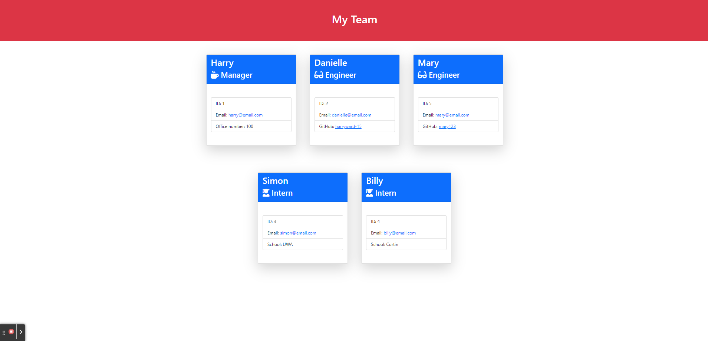

# Software Engineering Team Generator
[](https://opensource.org/licenses/MIT)

## Table of Contents
* [Description](#description)
* [User-Story](#user-story)
* [Acceptance-Criteria](#acceptance-criteria)
* [Installation](#installation)
* [Usage](#usage)
* [License](#license)
* [Questions](#questions)
* [Credits](#credits)

## Description

This is my Software Engineering Team Genertor. This app is based on OOP and uses node.js. The main idea was to create a simple terminal application that allows a user to add a manager, engineers and interns to their team and then generate a html document that displayed the data they had input. Included in this Repo is the test framework, source code and example.

## User Story

```md
AS A manager
I WANT to generate a webpage that displays my team's basic info
SO THAT I have quick access to their emails and GitHub profiles
```

## Acceptance Criteria

```md
GIVEN a command-line application that accepts user input
WHEN I am prompted for my team members and their information
THEN an HTML file is generated that displays a nicely formatted team roster based on user input
WHEN I click on an email address in the HTML
THEN my default email program opens and populates the TO field of the email with the address
WHEN I click on the GitHub username
THEN that GitHub profile opens in a new tab
WHEN I start the application
THEN I am prompted to enter the team manager’s name, employee ID, email address, and office number
WHEN I enter the team manager’s name, employee ID, email address, and office number
THEN I am presented with a menu with the option to add an engineer or an intern or to finish building my team
WHEN I select the engineer option
THEN I am prompted to enter the engineer’s name, ID, email, and GitHub username, and I am taken back to the menu
WHEN I select the intern option
THEN I am prompted to enter the intern’s name, ID, email, and school, and I am taken back to the menu
WHEN I decide to finish building my team
THEN I exit the application, and the HTML is generated
```

## Installation

In order to use this generator, you will need to have node.js installed, other than than all you need is to download the source code from this repository!

## Live Demo - Click for video

[](./assets/demo.mp4)

Or link: https://www.youtube.com/watch?v=gEJO4nPcVWk

## Usage

To use the generator, do the following:

1) Navigate to the project directory where you have downloaded the source code

2) Now run the following commands in order
----------

``` 
npm install 
```
----------
```
npm run test
```
----------

3) Assuming you have installed the node modules correctly and the code is not outdated, all tests should pass, if so, run the following command
```
node index.js
```
----------
4) Follow the prompts given until you have finished your team.

5) Once completed, your index.html file will appear in the dist/ directory


## License

  ```
  This project is covered under the MIT License license. To learn more about what this means, click the license button at the top
  ```

## Questions

Have questions about this project?\
GitHub: https://github.com/Harry-Ward15\
Email: hward.1508@gmail.com

## Credits

Starter code was written by UWA Bootcamp 2022/23
